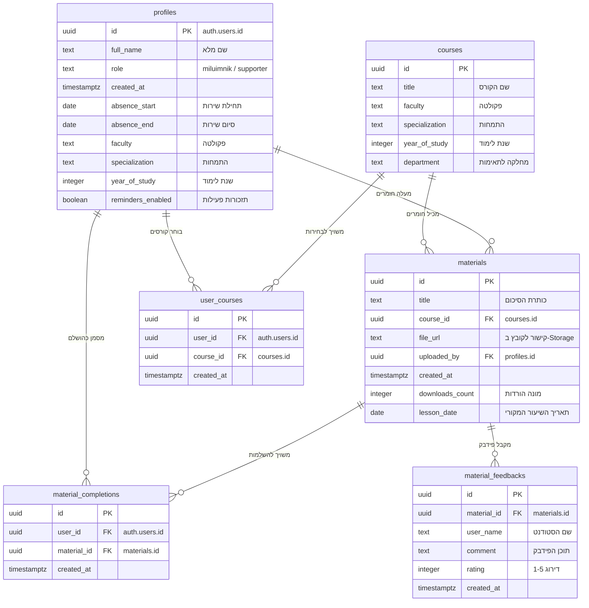

# MyluimSync — מערכת סנכרון והשלמת חומרי לימוד למשרתי מילואים

מערכת ענן אינטראקטיבית המאפשרת לחיילי מילואים אקדמיים לצמצם פערים לימודיים על ידי התאמה אישית של סיכומים, שיעורים מוקלטים וחומרי עזר בהתאם לפקולטה, להתמחות ולתאריכי שירות המילואים שלהם.

📌 **קישור לפרויקט החי ב-Vercel:** [https://myluim-sync.vercel.app](https://myluim-sync.vercel.app) *(או הקישור העדכני של פרויקט ה-Vercel שלך)*

---

## 🎯 הגדרת המוצר והערך

### 1. הבעיה (הכאב)
סטודנטים המשרתים במילואים נאלצים להפסיד שבועות רבים של לימודים במהלך הסמסטר. כיום, השלמת החומר מתבצעת בצורה לא מנוהלת ומפוזרת: פניות ידניות לחברים בוואטסאפ, חיפוש קבצים בתיקיות Drive מבולגנות, או פניות חוזרות למרצים. מילואימניקים מאבדים זמן יקר בניסיון להבין **איזה חומר בדיוק הם הפסידו** בתקופה הספציפית שבה שירתו, ומה מתוך זה שייך לקורסי החובה שלהם.

### 2. קהל היעד
* **סטודנטים משרתי מילואים (מילואימניקים):** צריכים לדעת בדיוק מה הם הפסידו, להוריד חומרי לימוד רלוונטיים, ולעקוב אחר קצב ההשלמה האישי שלהם.
* **סטודנטים תומכים אקדמיים (מתנדבים):** סטודנטים מהמוסד שמסייעים על ידי העלאה מרוכזת של סיכומים, מצגות, הקלטות שמע (כגון NotebookLM) וקבצי תרגול.

### 3. מתחרים ובידול
* **מתחרים קיימים:** קבוצות וואטסאפ כיתתיות, תיקיות Google Drive שיתופיות, אתר המוסד הלימודי (Moodle).
* **הבידול והערך המוסף של MyluimSync:**
  * **הפרדה מוחלטת של פקולטות והתמחויות:** המערכת מספקת סינון מדויק לפי פקולטה, התמחות ושנת לימוד (מותאם במיוחד למאגר הקורסים של הקריה האקדמית אונו).
  * **סינון מבוסס תאריכי שירות:** המילואימניק מגדיר את תקופת שירות המילואים שלו, והמערכת מסננת עבורו את חומרי הלימוד לפי **תאריך השיעור המקורי** (ולא לפי תאריך העלאת הקובץ).
  * **מדדי השלמה וסטטיסטיקה (Progress Metrics):** לוח בקרה אישי שמציג בדיוק כמה חומרי לימוד החסיר המשתמש, כמה מתוכם הוא סימן כ-"הושלם" (Mark as Completed), וכמה נשאר לו להשלים כדי לסגור את הפער.
  * **תזכורות אי-כניסה חכמות:** התראה אקטיבית בפתיחת הדאשבורד במידה והמשתמש לא נכנס למערכת מעל יומיים ויש לו פערים להשלים (עם אפשרות לכיבוי בהגדרות הפרופיל).

---

## 🔑 נתוני דמו לבדיקה (Demo Credentials)

כדי לאפשר בדיקה מהירה של המערכת מקצה לקצה ללא צורך ברישום, הגדרנו מראש שני משתמשי דמו מאומתים ב-Supabase:

### 1. פרופיל חייל מילואים (Miluimnik)
* **אימייל:** `soldier@ono.ac.il`
* **סיסמה:** `password123`
* **נתוני פרופיל מוגדרים:** פקולטת *מנהל עסקים*, התמחות *מערכות מידע*, *שנה א'*. מוגדרת היעדרות לצורך סינון חומרים.

### 2. פרופיל סטודנט תומך אקדמי (Supporter)
* **אימייל:** `supporter@ono.ac.il`
* **סיסמה:** `password123`
* **תפקיד:** סטודנט תומך המורשה להעלות חומרי לימוד לקורסים השונים במערכת.

---

## 📊 מודל הנתונים (Supabase ERD)

המערכת עושה שימוש ב-Supabase כבסיס נתונים רלציוני (PostgreSQL) עם הפעלת מנגנון אבטחת מידע קפדני ברמת השורה (Row Level Security - RLS).



---

## 🔌 שירותים חיצוניים ואינטגרציות

המערכת נשענת על השירותים הבאים לפעילותה התקינה:

| שם השירות | סוג אינטגרציה | תפקיד במערכת |
|---|---|---|
| **Supabase Auth** | אוטנטיקציה וניהול משתמשים | הרשמה והתחברות מאובטחת, הצפנת סיסמאות, וניהול הרשאות תפקידים (מילואימניק/תומך). |
| **Supabase Database (PostgreSQL)** | בסיס נתונים בענן | שמירת פרטי פרופילים, קורסים, חומרי לימוד, פידבקים וקשרי מעקב ההתקדמות. |
| **Supabase Storage** | אחסון קבצים (Object Storage) | שמירה ואירוח פיזי של קבצי הלימוד המועלים (PDF, Word, Excel וכו') בתוך Bucket ייעודי וציבורי. |

---

## 🚀 הוראות הרצה מקומיות (Local Setup)

1. **שכפול הפרויקט:**
   ```bash
   git clone https://github.com/Sjole-lab/MyluimSync.git
   cd MyluimSync
   ```

2. **התקנת תלויות:**
   ```bash
   npm install
   ```

3. **הגדרת משתני סביבה:**
   צרו קובץ `.env` בתיקיית השורש של הפרויקט עם המפתח הציבורי וכתובת ה-Supabase שלכם:
   ```env
   VITE_SUPABASE_URL=https://your-project-id.supabase.co
   VITE_SUPABASE_ANON_KEY=your-anon-key
   ```

4. **הרצה במצב פיתוח:**
   ```bash
   npm run dev
   ```
   האתר יהיה זמין בכתובת [http://localhost:5173](http://localhost:5173) (או פורט פנוי אחר).
